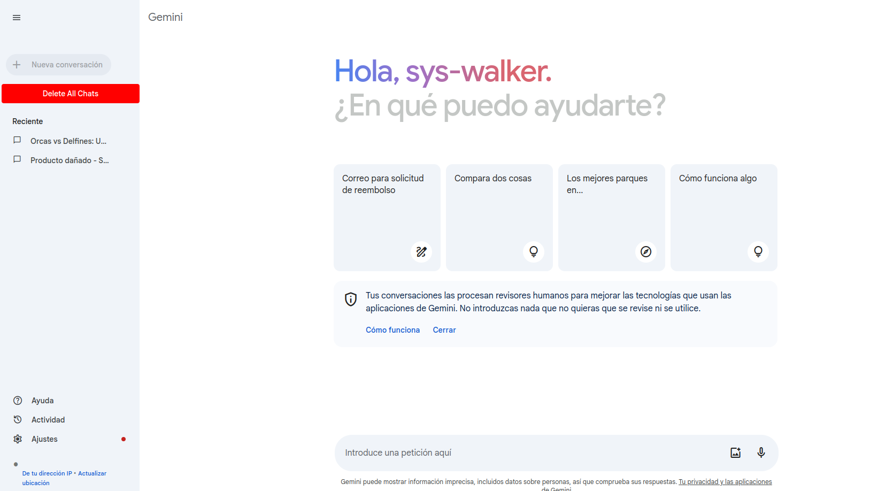

# Delete All Bard Chats (Caballo)

This is a code repository for a browser extension that allows us to delete all active chats in Bard. It removes all chats with a single click.

Caballo was the original name of the original script that was created as a meme and ended up as an extension.


# Compatibility

Works in all browsers I guess

# Usage

To use this extension locally in your machine.

Clone the repo Using terminal

```
git clone git@github.com:sys-walker/delete-chats-caballo.git

```

### For Firefox Users:
go the address bar of your browser and type:

```
about:debugging#/runtime/this-firefox

```

Selct the `Load Temporary Addons`option and select the `manifest.json` file from the directory.

### For Chrome Users:
go the address bar of your browser and type:

```
chrome://extensions/

```

enable developer mode

Expand the Developer dropdown menu and click `Load Unpacked Extension`
Navigate to the local folder containing the extension’s code and click OK

## Final result

Now,visit the bard.google.com site and you will see a `Delete All Chats` button near the button `new chat`



You can see the `Delete All Chats` easily which on click will delete all active chats
